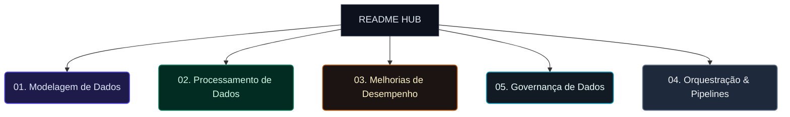
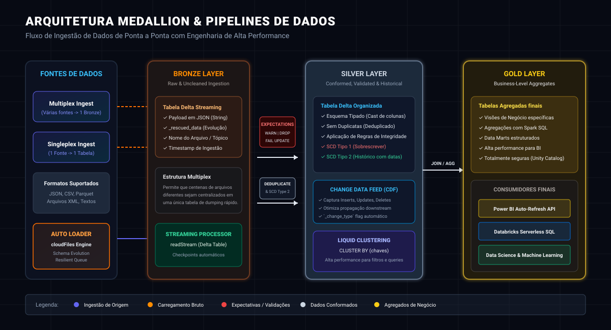
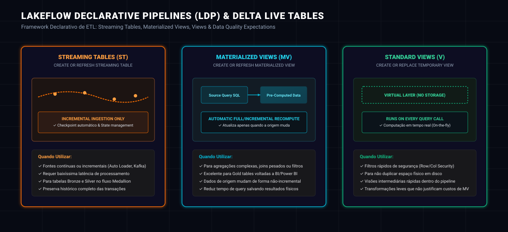
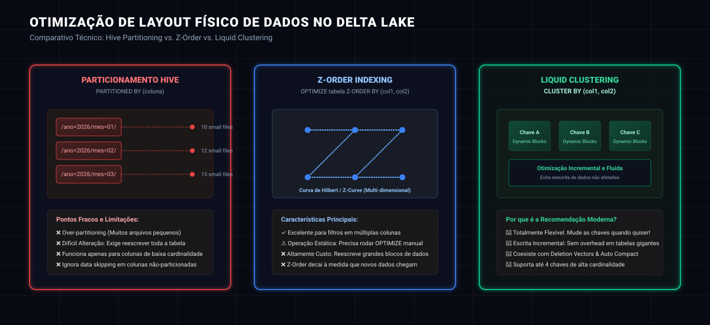
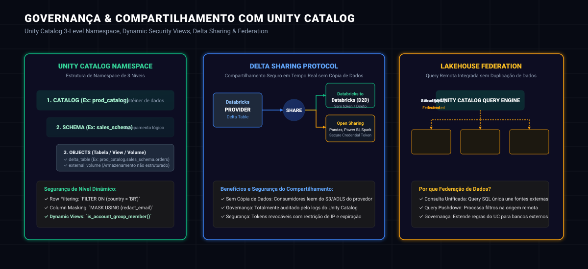
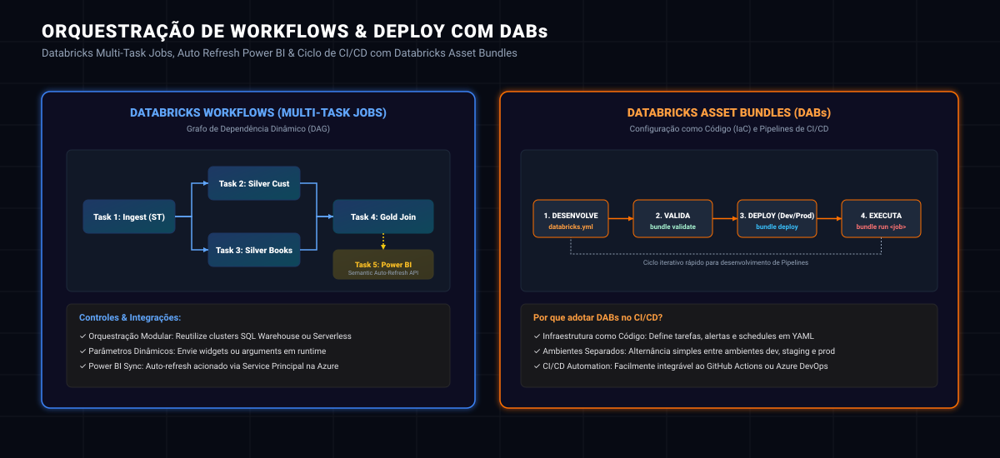

# 🚀 Databricks Certified Data Engineer Professional: Guia Definitivo de Estudos e Referência Técnica

<p align="center">
  
</p>

<p align="center">
  <a href="https://img.shields.io/badge/Databricks-Certified-FF6F00?style=for-the-badge&logo=databricks&logoColor=white">
    
  </a>
  <a href="https://img.shields.io/badge/Data%20Engineer-Professional-10B981?style=for-the-badge&logo=apachespark&logoColor=white">
    
  </a>
  <a href="https://img.shields.io/badge/Delta_Lake-v3.0-0D9488?style=for-the-badge&logo=delta&logoColor=white">
    
  </a>
  <a href="https://img.shields.io/badge/Language-SQL%20%7C%20Python-3776AB?style=for-the-badge&logo=python&logoColor=white">
    
  </a>
</p>

---

## 🎯 Sobre este Repositório

Este repositório é um **manual de referência avançada e hub de estudos** completo para a certificação **Databricks Certified Data Engineer Professional**. O material é derivado do curso preparatório de *Derar Alhussein*, enriquecido com anotações de aula, exemplos práticos de sintaxe de código (SQL e PySpark), e **diagramas arquiteturais detalhados gerados por código** para facilitar a consolidação visual do conhecimento.

Ele serve tanto como repositório de preparação para o exame quanto como um **guia rápido de consulta técnica diária** sobre as melhores práticas do ecossistema Databricks, Lakehouse, Delta Lake, Unity Catalog, e pipelines de dados modernos.

---

## 🗺️ Mapa de Navegação Rápida

Explore diretamente o conteúdo organizado por áreas temáticas através dos links interativos abaixo:



---

## 🎨 Diagramas Técnicos & Conteúdo de Estudos

---

### 1. Arquitetura Medallion e Modelagem de Dados

A arquitetura Medallion organiza os dados de maneira incremental dentro do Lakehouse, dividida em três camadas físicas estruturadas. Esta abordagem garante qualidade, histórico confiável e preparação otimizada para relatórios e inteligência artificial.

#### Ingestão de Origem: Singleplex vs. Multiplex
*   **Singleplex (Ingestão 1 para 1):** Mapeia cada origem de arquivo individual para uma tabela Bronze dedicada. Ideal para fontes que possuem esquemas completamente diferentes e baixa taxa de ingestão de arquivos.
*   **Multiplex (Ingestão Muitos para 1):** Centraliza dezenas ou centenas de fontes em uma única tabela Bronze unificada. Os dados chegam com metadados (identificador do tópico ou nome do arquivo original) e a carga útil original (normalmente um dump JSON em string ou binário). Isso reduz drasticamente o número de tabelas ativas e o overhead de inicialização no Spark.

#### Auto Loader (`cloudFiles`)
O Auto Loader processa arquivos novos de forma incremental e escalável na nuvem, oferecendo:
*   **Schema Evolution:** Detecção automática de mudanças no esquema dos arquivos (colunas novas ou alteradas) sem quebrar o pipeline de dados.
*   **Rescued Data Column (`_rescued_data`):** Salva qualquer dado que não atenda ao esquema atual da tabela (dados corrompidos ou tipos inválidos), prevenindo a perda silenciosa de informações.

#### Slowly Changing Dimensions (SCD)
*   **SCD Tipo 1 (Sobrescrita):** Substitui diretamente os dados antigos de uma linha de dimensão. Não mantém histórico.
*   **SCD Tipo 2 (Histórico Completo):** Cria uma nova linha para cada alteração no atributo da dimensão, contendo campos como `start_date`, `end_date`, e um flag `is_current = True/False`. É a base das análises históricas retroativas em Data Warehouses.

#### Expectations (Delta Quality Control)
As expectativas são regras declarativas de qualidade aplicadas diretamente sobre os registros que entram na camada Silver:
*   **WARN:** O registro ruim é inserido, mas um alerta é adicionado às métricas.
*   **DROP ROW:** O registro inválido é descartado do fluxo, porém o processamento do lote continua normalmente.
*   **FAIL UPDATE:** A carga de processamento inteira é abortada caso um registro viole a expectativa declarada.

---

#### 📊 Diagrama 01: Fluxo de Ponta a Ponta na Arquitetura Medallion


---

<details>
<summary>💻 Cheat Sheet de Código: Ingestão, Expectations e SCD</summary>

#### Configuração de Auto Loader em PySpark
```python
# Ingestão de arquivos JSON usando cloudFiles
df = (spark.readStream
      .format("cloudFiles")
      .option("cloudFiles.format", "json")
      .option("cloudFiles.schemaLocation", "/mnt/schemas/bronze_customers")
      .option("cloudFiles.maxBytesPerTrigger", "10m") # Limita tamanho do trigger
      .load("/mnt/raw/customers"))

# Escrita em formato Delta com checkpointing automático
(df.writeStream
 .format("delta")
 .option("checkpointLocation", "/mnt/checkpoints/bronze_customers")
 .outputMode("append")
 .start("/mnt/delta/bronze_customers"))
```

#### Definição de Quality Expectations (DLT SQL / Lakeflow)
```sql
-- Criando uma tabela Silver com restrição de validação de dados
CREATE OR REFRESH STREAMING TABLE silver_customers (
  CONSTRAINT valid_id EXPECT (id IS NOT NULL) ON VIOLATION FAIL UPDATE,
  CONSTRAINT valid_email EXPECT (email LIKE '%@%') ON VIOLATION DROP ROW
)
AS SELECT 
  id, 
  name, 
  email,
  _rescued_data
FROM STREAM(live.bronze_customers);
```

#### Implementação de SCD Tipo 2 no Delta Lake (PySpark / Delta API)
```python
from delta.tables import *

deltaTable = DeltaTable.forPath(spark, "/mnt/delta/silver_users_scd2")

# Preparação de novos registros com flags de vigência
new_records_df = spark.read.table("bronze_users_updates")

# Expressão para realizar o Upsert (Merge Into) para SCD Tipo 2
# (Fecha registros antigos alterando end_date e insere novos como ativos)
# Código prático detalhado no notebook 1.5 de Modelagem de dados
```
</details>

---

### 2. Processamento de Dados Avançado

Nesta seção, o foco está em operações complexas de tratamento de dados:
*   **Change Data Capture (CDC) & Change Data Feed (CDF):** O CDF captura mudanças em nível de linha em uma tabela Delta. Quando habilitado (`delta.enableChangeDataFeed = true`), ele gera metadados contendo colunas como `_change_type` (`insert`, `update_preimage`, `update_postimage`, `delete`) e um timestamp, facilitando o processamento incremental downstream.
*   **Stream-Stream Joins:** União em tempo real entre dois fluxos de streaming de dados. Para evitar o crescimento infinito do estado em memória do Spark, exige-se a definição de limites de tempo (**watermarks**) e restrições de tempo relativo entre os dois fluxos.
*   **Stream-Static Joins:** Junção de um fluxo de dados em tempo real com uma tabela estática (como tabelas de dimensão de referência). O Databricks faz o cache dinâmico da tabela estática automaticamente para ganho de performance.

---

#### 📊 Diagrama 02: Lakeflow Pipelines & Processamento Incremental


---

<details>
<summary>💻 Cheat Sheet de Código: Captura CDC/CDF e Stream Joins</summary>

#### Habilitando e Lendo o Change Data Feed (CDF)
```sql
-- Habilitando CDF na tabela Silver
ALTER TABLE silver_customers SET TBLPROPERTIES (delta.enableChangeDataFeed = true);

-- Lendo mudanças (CDC) de um intervalo específico via SQL
SELECT * FROM table_changes('silver_customers', 150, 180); -- Intervalo de versão
SELECT * FROM table_changes('silver_customers', '2026-05-25 00:00:00'); -- Por timestamp
```

#### Stream-Stream Join com Watermark
```python
# Definindo watermarks para controle de atraso de dados e junção de streams
orders_stream = (spark.readStream.table("silver_orders")
                 .withWatermark("order_time", "2 hours"))

payments_stream = (spark.readStream.table("silver_payments")
                   .withWatermark("payment_time", "1 hour"))

# Junção usando a restrição temporal (condição sobre os watermarks)
joined_stream = orders_stream.join(
    payments_stream,
    expr("""
      orders_stream.order_id = payments_stream.order_id AND
      payment_time >= order_time AND
      payment_time <= order_time + interval 1 hour
    """),
    joinType="inner"
)
```
</details>

---

### 3. Otimização de Performance e Armazenamento Delta

O Delta Lake no Databricks possui motores de otimização de nível físico extremamente avançados, que reduzem latências de queries de horas para segundos.

#### Layout Físico de Dados
*   **Particionamento Hive (Físico tradicional):** Organiza os arquivos fisicamente em subdiretórios baseados nas colunas declaradas (ex: `/ano=2026/`). É eficiente apenas para colunas de baixíssima cardinalidade e volumes de dados onde cada partição contém mais de 1 GB.
*   **Z-Ordering (Multidimensional estático):** Agrupa dados de forma multidimensional em um único arquivo físicos para maximizar a eficácia do *data skipping*. O ponto fraco é que exige a execução manual e recorrente do comando `OPTIMIZE` e consome muitos recursos computacionais por reescrever grandes blocos de dados.
*   **Liquid Clustering (Moderna Otimização Dinâmica):** Substitui completamente o particionamento Hive e Z-Order. Habilitado pela sintaxe simples `CLUSTER BY (col1, col2)`. Ele organiza os dados de maneira dinâmica em pequenos blocos fluidos e apenas as frações modificadas são otimizadas. Permite redefinir as chaves de clusterização a qualquer momento sem reescrever a tabela completa!

#### Deletion Vectors (Vetores de Deleção)
Ao invés de reescrever um arquivo Parquet inteiro de 128 MB quando uma única linha é alterada ou deletada (o que causava o tradicional overhead de escrita do Delta Lake), o Databricks cria um pequeno arquivo indexado contendo apenas o endereço das linhas excluídas ou modificadas (**Deletion Vectors**). As operações de escrita se tornam ordens de grandeza mais rápidas e com menor consumo de IO.

#### Otimização Preditiva (Predictive Optimization)
Utiliza IA nativa para determinar quando tabelas específicas devem rodar operações de limpeza e compactação de forma automática em segundo plano, liberando o engenheiro de dados da necessidade de agendar tarefas manuais de `OPTIMIZE`, `VACUUM` ou `ANALYZE`.

---

#### 📊 Diagrama 03: Performance e Otimização do Delta Lake


---

<details>
<summary>💻 Cheat Sheet de Código: Liquid Clustering & Otimizações Físicas</summary>

#### Habilitando o Liquid Clustering em uma nova tabela
```sql
-- Criando uma tabela já configurada com Liquid Clustering por chaves de filtro comum
CREATE TABLE silver_transactions (
  transaction_id STRING,
  customer_id STRING,
  transaction_date DATE,
  amount DOUBLE
)
USING DELTA
CLUSTER BY (customer_id, transaction_date);
```

#### Alterando chaves de clusterização dinamicamente
```sql
-- Caso as consultas mudem, podemos alterar as chaves sem reescrever dados
ALTER TABLE silver_transactions CLUSTER BY (transaction_id);

-- Otimização incremental subsequente usará a nova chave
OPTIMIZE silver_transactions;
```

#### Ativação manual de Deletion Vectors e Auto Otimizações
```sql
-- Ativando vetores de deleção para updates ultrarrápidos
ALTER TABLE silver_transactions SET TBLPROPERTIES (
  'delta.enableDeletionVectors' = 'true'
);

-- Ativando gravação otimizada e auto-compactação combinados
ALTER TABLE silver_transactions SET TBLPROPERTIES (
  'delta.autoOptimize.optimizeWrite' = 'true',
  'delta.autoOptimize.autoCompact' = 'true'
);
```
</details>

---

### 4. Governança, Segurança e Compartilhamento

A governança do ecossistema Lakehouse é centralizada no **Unity Catalog**, que fornece controle granular em nível corporativo de dados estruturados e não-estruturados.

#### Namespace de 3 Níveis
Acesso total aos objetos do Lakehouse seguindo o padrão universal:
`catalog.schema.table_or_view` (Exemplo: `main.sales.orders`)

#### Dynamic Row & Column Level Security
Permite criar exibições dinâmicas que filtram ou mascaram os dados dependendo de qual usuário ou grupo corporativo está executando a consulta:
*   `is_account_group_member('nome_grupo')`: Valida se o usuário pertence ao grupo autorizado.
*   `current_user()`: Obtém o e-mail ou identificador do usuário conectado.

#### Delta Sharing
Protocolo aberto de compartilhamento seguro de grandes volumes de dados de forma assíncrona, direta e sem necessidade de copiar arquivos físicos:
*   **Databricks-to-Databricks (D2D):** Compartilhamento direto entre workspaces Databricks. Rápido, direto e serverless.
*   **Open Sharing (Aberto):** Compartilha tabelas com parceiros externos fora do Databricks. O receptor recebe uma chave de segurança temporária (Credential Token) para ler o repositório por meio de bibliotecas abertas como Pandas, Apache Spark ou Power BI.

#### Lakehouse Federation
Capacidade de conectar o Databricks a outros bancos de dados externos (como Snowflake, Azure SQL, PostgreSQL, AWS Redshift) mapeando-os como schemas dentro do Unity Catalog. Isso permite consultas SQL unificadas de baixa latência usando *query pushdown* (processamento feito no banco de origem).

---

#### 📊 Diagrama 04: Governança de Dados com Unity Catalog e Delta Sharing


---

<details>
<summary>💻 Cheat Sheet de Código: Unity Catalog & Dynamic Security Views</summary>

#### Criando um Dynamic Row Filter (SQL)
```sql
-- Função dinâmica que retorna TRUE apenas se o usuário puder ver os dados daquele país
CREATE OR REPLACE FUNCTION sales_catalog.sales_schema.country_filter(country_code STRING)
RETURN 
  is_account_group_member('global_managers') OR 
  (is_account_group_member('br_sales') AND country_code = 'BR') OR
  (is_account_group_member('us_sales') AND country_code = 'US');

-- Aplicando o filtro na tabela de vendas
ALTER TABLE sales_catalog.sales_schema.orders 
SET ROW FILTER sales_catalog.sales_schema.country_filter ON (customer_country);
```

#### Mascaramento Dinâmico de Coluna (Column Masking)
```sql
-- Função para mascarar e-mails para analistas de nível júnior
CREATE OR REPLACE FUNCTION sales_catalog.sales_schema.email_mask(email STRING)
RETURN CASE 
  WHEN is_account_group_member('admin_managers') THEN email
  ELSE '***MASKED***'
END;

-- Aplicando o mascaramento de coluna na tabela de clientes
ALTER TABLE sales_catalog.sales_schema.customers 
ALTER COLUMN email SET MASK sales_catalog.sales_schema.email_mask;
```
</details>

---

### 5. Orquestração, Pipelines e Ciclo de Vida (CI/CD)

Agendar, gerenciar falhas, propagar parâmetros e implantar código na nuvem são as bases operacionais da engenharia de dados corporativa.

#### Databricks Workflows (Multi-Task Jobs)
Gerenciador nativo de DAGs (Directed Acyclic Graphs) de alta performance:
*   Suporta execução sequencial ou concorrente de múltiplos tipos de tarefas (Notebooks, Scripts Python, consultas SQL do DLT, ou chamadas de API).
*   **Controle de Parâmetros:** Passagem flexível de variáveis no início da tarefa via widgets no Notebook ou por herança de parâmetros do Job.

#### Integração Auto Refresh Power BI via API
A integração direta entre Databricks Pipelines e Power BI permite acionar o recálculo dos modelos semânticos do BI no encerramento de um pipeline de ETL:
1.  **Registro de Aplicativo na Azure (Service Principal):** Concede as credenciais e o ID da aplicação à Azure e atribui permissões de API de leitura/gravação ao Power BI.
2.  **Configuração do Power BI Service:** Habilita o uso de APIs para a aplicação criada e a coloca no grupo administrativo do Workspace do Power BI.
3.  **Databricks Connection & Workflows:** Configura uma nova conexão no catálogo no formato `OAuth Machine to Machine` e adiciona uma task do tipo **Power BI** no final do Job.

#### Databricks Asset Bundles (DABs) & CLI
DABs são o framework oficial do Databricks para gerenciar projetos de dados como infraestrutura de código (**Infrastructure as Code - IaC**). Permitem estruturar jobs, notebooks, tabelas Delta e configurações em um único repositório configurado via arquivo YAML `databricks.yml`.
*   `databricks bundle validate`: Verifica a sintaxe dos arquivos de configuração e integridade.
*   `databricks bundle deploy`: Envia os notebooks e monta os Jobs dentro do ambiente Databricks (seja ele dev, staging ou prod).
*   `databricks bundle run`: Dispara a execução manual e monitoramento do Job de teste.

---

#### 📊 Diagrama 05: Orquestração Workflows, Auto Refresh Power BI e DABs


---

<details>
<summary>💻 Cheat Sheet de Código: Databricks CLI, DABs e Parâmetros</summary>

#### Comandos Úteis do Databricks CLI v2
```powershell
# Autenticar a CLI com o workspace Databricks
databricks configure --use-profile

# Validar e fazer deploy do projeto local usando DABs
databricks bundle validate
databricks bundle deploy -t target_prod

# Rodar um Job recém criado pelo Bundle
databricks bundle run my_etl_job
```

#### Passagem de Parâmetros via Widgets (Notebook PySpark)
```python
# Criando um Widget de texto no início do notebook
dbutils.widgets.text("env", "dev", "Ambiente de Execução")
dbutils.widgets.text("data_limite", "2026-01-01", "Data Limite")

# Resgatando o parâmetro enviado pelo orquestrador
ambiente = dbutils.widgets.get("env")
data_corte = dbutils.widgets.get("data_limite")

print(f"Executando pipeline no ambiente: {ambiente} a partir de {data_corte}")

# Filtrando dados usando a variável coletada do widget
df_filtrado = spark.read.table("silver_orders").filter(f"order_date >= '{data_corte}'")
```
</details>

---

## 🗂️ Índice de Navegação Prática dos Arquivos

Esta seção fornece acesso direto com descrições curtas e links de atalhos funcionais para cada arquivo de estudo do repositório.

### 📚 1. Pasta do Curso (`00.Curso/`)
Esta pasta contém os códigos e exercícios estruturados do curso de preparação para a certificação.

*   📂 **Includes**
    *   📄 [Copy-Datasets.py](file:///c:/Users/fraja/Downloads/readme/Databricks-Professional-main/00.Curso/00.Includes/Copy-Datasets.py): Script de inicialização e cópia dos datasets de testes.
    *   📄 [Reset-Datasets.py](file:///c:/Users/fraja/Downloads/readme/Databricks-Professional-main/00.Curso/00.Includes/Reset-Datasets.py): Script para restaurar e limpar os dados de treino.
*   📂 **01. Modelagem de Dados**
    *   📄 [1.1 - Multiplex Bronze](file:///c:/Users/fraja/Downloads/readme/Databricks-Professional-main/00.Curso/01.Modelagem_de_dados/1.1%20-%20Multiplex%20Bronze.py): Ingestão e montagem da tabela Bronze unificada (Multiplex).
    *   📄 [1.2 - Streaming from Multiplex Bronze](file:///c:/Users/fraja/Downloads/readme/Databricks-Professional-main/00.Curso/01.Modelagem_de_dados/1.2%20-%20Streaming%20from%20Multiplex%20Bronze.py): Leitura incremental a partir da tabela Bronze Multiplex.
    *   📄 [1.3 - Quality Enforcement](file:///c:/Users/fraja/Downloads/readme/Databricks-Professional-main/00.Curso/01.Modelagem_de_dados/1.3%20-%20Quality%20Enforcement.py): Validações e aplicação de expectativas de qualidade.
    *   📄 [1.4 - Streaming Deduplication](file:///c:/Users/fraja/Downloads/readme/Databricks-Professional-main/00.Curso/01.Modelagem_de_dados/1.4%20-%20Streaming%20Deduplication.py): Remoção de duplicatas em fluxos streaming de dados.
    *   📄 [1.5 - Type 2 SCD](file:///c:/Users/fraja/Downloads/readme/Databricks-Professional-main/00.Curso/01.Modelagem_de_dados/1.5%20-%20Type%202%20SCD.py): Implementação prática de Slowly Changing Dimensions Tipo 2.
*   📂 **02. Processamento de Dados**
    *   📄 [2.1 - Change Data Capture](file:///c:/Users/fraja/Downloads/readme/Databricks-Professional-main/00.Curso/02.Processamento_de_dados/2.1%20-%20Change%20Data%20Capture.py): Leitura de eventos de CDC no Delta Lake.
    *   📄 [2.2 - CDF](file:///c:/Users/fraja/Downloads/readme/Databricks-Professional-main/00.Curso/02.Processamento_de_dados/2.2%20-%20CDF.py): Configuração avançada de Change Data Feed (CDF).
    *   📄 [2.3 - Stream-Stream Joins](file:///c:/Users/fraja/Downloads/readme/Databricks-Professional-main/00.Curso/02.Processamento_de_dados/2.3%20-%20Stream-Stream%20Joins.py): Junção de fluxos contínuos de tempo real com watermarks.
    *   📄 [2.4 - Stream-Static Join](file:///c:/Users/fraja/Downloads/readme/Databricks-Professional-main/00.Curso/02.Processamento_de_dados/2.4%20-%20Stream-Static%20Join.py): Junção de fluxos streaming com tabelas Delta estáticas.
    *   📄 [2.5 - Gold Tables](file:///c:/Users/fraja/Downloads/readme/Databricks-Professional-main/00.Curso/02.Processamento_de_dados/2.5%20-%20Gold%20Tables.py): Consolidação final de agregados e KPIs de negócio para consumo.
*   📂 **03. Melhorias de Desempenho**
    *   📄 [3.1 - Python UDFs](file:///c:/Users/fraja/Downloads/readme/Databricks-Professional-main/00.Curso/03.Melhorias_de_Desempenho/3.1%20-%20Python%20UDFs.py): Otimização, paralelização e custos de funções do usuário (UDFs).
    *   📄 [3.2 - Data File Layout](file:///c:/Users/fraja/Downloads/readme/Databricks-Professional-main/00.Curso/03.Melhorias_de_Desempenho/3.2%20-%20Data%20File%20Layout.ipynb): Demonstrações de layouts (Hive, Z-Order, Liquid Clustering).
    *   📄 [3.3 - Predictive Optimization](file:///c:/Users/fraja/Downloads/readme/Databricks-Professional-main/00.Curso/03.Melhorias_de_Desempenho/3.3%20-%20Predictive%20Optimization.ipynb): Ativação e análise de Optimize, Vacuum e Analyze preditivos.
    *   📄 [3.4 - Auto Optimize](file:///c:/Users/fraja/Downloads/readme/Databricks-Professional-main/00.Curso/03.Melhorias_de_Desempenho/3.4%20-%20Auto%20Optimize.ipynb): Compactação automática e escritas otimizadas na Spark Session.
    *   📄 [3.5 - Deletion Vectors](file:///c:/Users/fraja/Downloads/readme/Databricks-Professional-main/00.Curso/03.Melhorias_de_Desempenho/3.5%20-%20Deletion%20Vectors.ipynb): Vetores de deleção e ganho de velocidade de DMLs.
*   📂 **04. Orquestração de Dados**
    *   Notebooks dedicados a criar fluxos e tarefas encadeadas passo a passo: [Task 1 - Land New Data.py](file:///c:/Users/fraja/Downloads/readme/Databricks-Professional-main/00.Curso/04.Orquestacao_de_dados/Task%201%20-%20Land%20New%20Data.py), [Task 2 - Bronze.py](file:///c:/Users/fraja/Downloads/readme/Databricks-Professional-main/00.Curso/04.Orquestacao_de_dados/Task%202%20-%20Bronze.py), [Task 3 - Silver Customers.py](file:///c:/Users/fraja/Downloads/readme/Databricks-Professional-main/00.Curso/04.Orquestacao_de_dados/Task%203%20-%20Silver_%20Customers.py), [Task 4 - Silver Orders.py](file:///c:/Users/fraja/Downloads/readme/Databricks-Professional-main/00.Curso/04.Orquestacao_de_dados/Task%204%20-%20Silver_%20Orders.py), etc.
*   📂 **05. Governança de Dados**
    *   📄 [5.1 - Propagating Deletes](file:///c:/Users/fraja/Downloads/readme/Databricks-Professional-main/00.Curso/05.Governancia_de_dados/5.1%20-%20Propagating%20Deletes.py): Gerenciamento de deleção segura e conformidade de privacidade de dados.
    *   📄 [5.2 - Dynamic Views](file:///c:/Users/fraja/Downloads/readme/Databricks-Professional-main/00.Curso/05.Governancia_de_dados/5.2%20-%20Dynamic%20Views.py): Implementação prática de views com filtros de linhas e colunas.
*   📂 **06. ETL Pipelines**
    *   📄 Projetos complexos completos de pipelines simulando cenários reais: [BookStore Pro Pipeline](file:///c:/Users/fraja/Downloads/readme/Databricks-Professional-main/00.Curso/06.ETL_Pipelines/BookStore%20Pro%20Pipeline), [DF_BOOK_STORE](file:///c:/Users/fraja/Downloads/readme/Databricks-Professional-main/00.Curso/06.ETL_Pipelines/DF_BOOK_STORE) e orquestrações de [JOB_V2_TASKS](file:///c:/Users/fraja/Downloads/readme/Databricks-Professional-main/00.Curso/06.ETL_Pipelines/JOB_V2_TASKS).
*   📂 **07. Testes e Implementação**
    *   📄 [7.1 - CLI.py](file:///c:/Users/fraja/Downloads/readme/Databricks-Professional-main/00.Curso/07.Testes_e_implementacao/7.1%20-%20CLI.py): Comandos de automação do terminal para CLI e DABs.

---

### 📝 2. Pasta de Documentação Detalhada (`01.Documentação/`)
Notebooks de aprofundamento focados em tópicos conceituais específicos e sintaxes de referência rápida exigidas na prova de engenheiro profissional.

1.  📓 [01. Singleplex VS Multiplex.ipynb](file:///c:/Users/fraja/Downloads/readme/Databricks-Professional-main/01.Documentação/01.Singleplex_VS_Multiplex.ipynb): Diferenças e arquiteturas de mapeamento de fontes de dados na camada Bronze.
2.  📓 [02. AutoLoader Configuration.ipynb](file:///c:/Users/fraja/Downloads/readme/Databricks-Professional-main/01.Documentação/02.AutoLoader_Configuration.ipynb): Configurações detalhadas, trigger bytes, schema evolution e registros corrompidos.
3.  📓 [03. SCD Slowly Changing Dimensions.ipynb](file:///c:/Users/fraja/Downloads/readme/Databricks-Professional-main/01.Documentação/03.SCD_Slowly_Changing_Dimensions.ipynb): Teoria e melhores práticas de modelagem SCD Tipo 1 e SCD Tipo 2.
4.  📓 [04. CDC Change Data Capture.ipynb](file:///c:/Users/fraja/Downloads/readme/Databricks-Professional-main/01.Documentação/04.CDC_Change_Data_Capture.ipynb): Detalhamento do CDF, cenários ideais e suas limitações de processamento.
5.  📓 [05. Particionamento.ipynb](file:///c:/Users/fraja/Downloads/readme/Databricks-Professional-main/01.Documentação/05.Particionalmento.ipynb): Particionamento Hive clássico no Delta Lake, seleção de colunas e boas práticas.
6.  📓 [06. LDP vs DLT.ipynb](file:///c:/Users/fraja/Downloads/readme/Databricks-Professional-main/01.Documentação/06.%20LDP_vs_DLT.ipynb): Quadro comparativo técnico completo entre Lakeflow Pipelines (LDP), Delta Live Tables e Spark.
7.  📓 [07. Data Quality Expectations.ipynb](file:///c:/Users/fraja/Downloads/readme/Databricks-Professional-main/01.Documentação/07.Data_Quality_Expectations.ipynb): Sintaxe SQL e PySpark das restrições de validação de dados (expectations).
8.  📓 [08. Auto CDC.ipynb](file:///c:/Users/fraja/Downloads/readme/Databricks-Professional-main/01.Documentação/08.Auto_CDC.ipynb): Sintaxes recomendadas e obsoletas de pipelines autogerenciados e de processamento CDC.
9.  📓 [09. Databricks Asset Bundles.ipynb](file:///c:/Users/fraja/Downloads/readme/Databricks-Professional-main/01.Documentação/09.Databricks_Asset_Bundles.ipynb): Configurações do arquivo YAML, fluxos de deploy e comandos CLI de DABs.
10. 📓 [10. Unity Catalog Commands.ipynb](file:///c:/Users/fraja/Downloads/readme/Databricks-Professional-main/01.Documentação/10.Unity_Catalog_Commands.ipynb): Comandos de SQL DDL avançados de segurança e governança no Unity Catalog.
11. 📓 [11. Delta Sharing.ipynb](file:///c:/Users/fraja/Downloads/readme/Databricks-Professional-main/01.Documentação/11.Delta_Sharing.ipynb): Mecanismo de compartilhamento D2D, Open sharing, taxas e limitações.
12. 📓 [12. Lakehouse Federation.ipynb](file:///c:/Users/fraja/Downloads/readme/Databricks-Professional-main/01.Documentação/12.Lakehouse_Federation.ipynb): Arquitetura de query remota unificada com múltiplos bancos de dados na nuvem.
13. 📓 [13. Cluster Configs.ipynb](file:///c:/Users/fraja/Downloads/readme/Databricks-Professional-main/01.Documentação/13.Cluster%20Configs.ipynb): Configurações de segurança do Spark, controle de acessos a clusters de execução.
14. 📓 [14. Window Function.ipynb](file:///c:/Users/fraja/Downloads/readme/Databricks-Professional-main/01.Documentação/14.%20Window%20Function.ipynb): Guia prático de funções de janela (Window Functions) em PySpark e SQL.
15. 📓 [15. Parametros.ipynb](file:///c:/Users/fraja/Downloads/readme/Databricks-Professional-main/01.Documentação/15.%20Parametros.ipynb): Passagem de parâmetros dinâmicos via widgets e agendamento de jobs.
16. 📓 [16. Billable Usage System.ipynb](file:///c:/Users/fraja/Downloads/readme/Databricks-Professional-main/01.Documentação/16.%20Billable%20Usege%20System.ipynb): Monitoramento detalhado de DBU (Databricks Unit), faturas e relatórios de custos por usuário.
17. 📄 [17. Auto Refresh PowerBI.md](file:///c:/Users/fraja/Downloads/readme/Databricks-Professional-main/01.Documentação/17.Auto%20Refresh%20PowerBI.md): Guia passo a passo completo da API do Power BI e conexões OAuth M2M.

---

## ⚡ Guia Rápido de Faturamento (DBU Optimization)

Uma área muito cobrada no exame profissional é o **Controle e Otimização de Custos (Billable Usage)**. Você pode monitorar o consumo das unidades DBU executando consultas SQL sobre as tabelas do sistema (`system.billing`).

<details>
<summary>📊 Consultas de Auditoria de Custos (Databricks System Tables)</summary>

#### Total de DBU consumido por pessoa no último mês
```sql
SELECT 
  usage_metadata.creator_email AS usuario,
  ROUND(SUM(usage_quantity), 2) AS total_dbu_usado,
  ROUND(SUM(usage_quantity) * 2.50, 2) AS custo_estimado_usd -- Preço médio estimado da DBU
FROM system.billing.usage
WHERE 
  usage_date >= DATE_SUB(CURRENT_DATE(), 30)
  AND sku_name LIKE '%SQL%' -- Filtrando apenas SQL Warehouses
GROUP BY usuario
ORDER BY total_dbu_usado DESC;
```

#### DBU total diário dividido por serviço
```sql
SELECT 
  usage_date,
  sku_name AS servico,
  SUM(usage_quantity) AS dbu_diario
FROM system.billing.usage
WHERE usage_date >= DATE_SUB(CURRENT_DATE(), 7)
GROUP BY usage_date, servico
ORDER BY usage_date DESC, dbu_diario DESC;
```
</details>

---

## 📝 Informações Importantes sobre o Exame

*   **Nome da Prova:** Databricks Certified Data Engineer Professional.
*   **Número de Questões:** 60 questões de múltipla escolha.
*   **Duração:** 120 minutos.
*   **Nota de Corte:** Mínimo de 70% de acertos (42 questões corretas).
*   **Custo da Inscrição:** $200 (reagendamento gratuito com mais de 24h de antecedência).
*   **Distribuição das Questões por Domínio:**
    1.  **Processamento de Dados (30%)**: Structured Streaming, Joins avançados, CDF, CDC.
    2.  **Modelagem de Dados (20%)**: Medallion, SCD Tipo 1 e 2, expectations de qualidade.
    3.  **Segurança e Governança (15%)**: Unity Catalog, dynamic views, grants.
    4.  **Monitoramento e Testes (15%)**: DABs, CLI, logging, faturamento de DBUs.
    5.  **Segurança e Otimizações de Performance (20%)**: Liquid Clustering, Deletion Vectors, file size optimization.
*   **Plataforma de Aplicação:** Kryterion / Webassessor (remoto supervisionado ou presencial em centros de teste).
